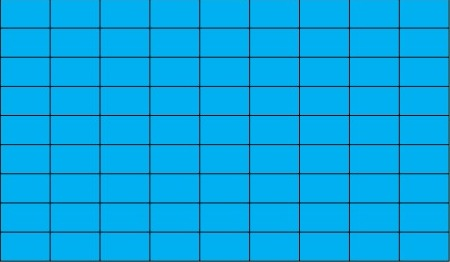
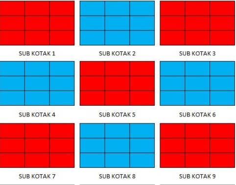
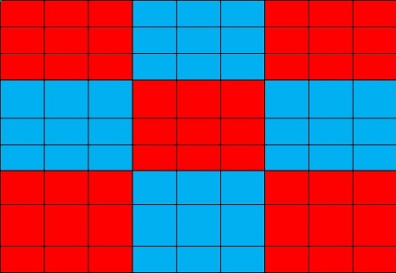
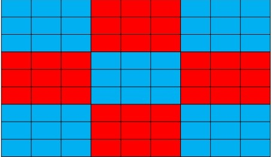

# KEC_Tugas2
## 1st State Awal  
 
Ukuran state space sesuai instruksi adalah 81!

## Kotak 9x9 dilakukan sub 3x3
 
kotak ukuran 9x9 dibagi menjadi sub 3x3 , sehingga state space dari sub tersebut adalah 9!

## End State 1

## End State 2
 
Terdapat 2 solusi untuk permasalahan ini:

Pada End State 1, kita  perlu mengubah 5 sub agar mencapai state akhir. 
Pada End State 2, kita hanya mengubah 4 sub agar mencapai state akhir.
